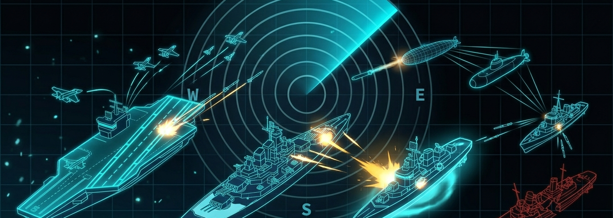

# Battle Ops — Battleship on Aspire

> A real-time, multiplayer Battleship game built on **.NET 10**, **ASP.NET Core Aspire**, **Dapr**, and **Angular 21**. A showcase of event-driven distributed application architecture, CQRS, SignalR real-time communication, and a tactical UI design system.

---

## Overview

**Battle Ops** is a browser-based, two-player Battleship game that runs entirely as an Aspire-orchestrated distributed application. Players connect anonymously — no accounts required — place their fleets on a 10×10 grid, and take turns firing at each other in real time. Every game action flows through a clean CQRS pipeline and is broadcast to both players via SignalR over Dapr pub/sub.

### Gameplay flow

| Phase | Description |
|---|---|
| **Landing** | Tactical control-station home page with ambient sonar audio and live activity feed |
| **Create** | Host generates a game with a unique code (and optional join secret) |
| **Join** | Guest enters the game code to enter the lobby |
| **Setup** | Both players place their five ships on the board and lock their fleet |
| **Combat** | Players alternate firing shots; hits, misses, and sunk ships are pushed to both clients in real time |
| **End** | The player who sinks the entire enemy fleet wins; abandoned or forfeited games end immediately |

---

## Tech Stack

### Frontend

| Technology | Version |
|---|---|
| Angular | `^21.2.0` |
| PrimeNG | `^21.1.4` |
| @microsoft/signalr | `^10.0.0` |
| RxJS | `~7.8.0` |
| TypeScript | `~5.9.2` |

### Backend

| Technology | Version |
|---|---|
| .NET / ASP.NET Core | `10.0` |
| .NET Aspire | `13.2.1` |
| Dapr | `1.17.7` |
| SignalR | Built-in (ASP.NET Core) |
| JWT Bearer Auth | `10.0.5` |

---

## Architecture

### Modular monolith with CQRS

The backend is a single deployable API composed of isolated domain modules. Each domain follows a three-project slice:

```
HexMaster.BattleShip.{Domain}               ← implementation
HexMaster.BattleShip.{Domain}.Abstractions  ← contracts, DTOs, handler interfaces
HexMaster.BattleShip.{Domain}.Tests         ← unit tests
```

HTTP endpoints accept **DTO records only**, map them to commands or queries, and invoke DI-injected handlers. Responses are always DTOs — never domain entities.

### Domains

```
src/
├── Profiles/       Anonymous player sessions, JWT issuance, Dapr state store persistence
├── Games/          Game lifecycle, fleet management, turn logic, win detection
├── Realtime/       SignalR hub, connection tracking, Dapr pub/sub subscriber
└── Core/           CQRS abstractions (ICommandHandler, IQueryHandler, IEventBus)
```

### Event-driven real-time pipeline

```
HTTP Request
    │
    ▼
Games Command Handler
    │  publishes integration event
    ▼
DaprEventBus ──► Dapr pub/sub ("pubsub" component)
                        │
                        ▼
             /subscriptions/realtime/*   (AllowAnonymous — called by Dapr sidecar)
                        │
                        ▼
             IHubContext<GameHub>.Clients.Group(gameCode)
                        │
              ┌─────────┴─────────┐
              ▼                   ▼
         Player A            Player B
       (WebSocket)          (WebSocket)
```

Both players join the SignalR group for their `gameCode` when they load the game page. All game events — `PlayerJoined`, `FleetLocked`, `GameStarted`, `ShotFired`, `GameFinished`, `GameAbandoned` — are pushed to the group.

### Connection resilience

If a player's WebSocket disconnects unexpectedly, a 60-second grace timer starts. If they reconnect within the window, the game resumes. If not, a `PlayerConnectionTimedOut` event fires and the game is abandoned.

---

## Project Structure

```
battleship-on-aspire/
├── src/
│   ├── App/                                   Angular 21 frontend
│   │   ├── src/app/pages/public/
│   │   │   ├── home/landing-page/             Tactical home page
│   │   │   └── games/
│   │   │       ├── create-game-page/          Create a new game
│   │   │       ├── join-game-page/            Join by game code
│   │   │       └── game-route-shell/          In-game: fleet setup + combat boards
│   │   └── scripts/start-with-backend-proxy.mjs
│   │
│   ├── Aspire/
│   │   ├── HexMaster.BattleShip.Aspire.AppHost/   Orchestration entry point
│   │   └── HexMaster.BattleShip.Aspire.ServiceDefaults/
│   │
│   ├── HexMaster.BattleShip.Api/              API entry point (Program.cs)
│   │
│   ├── Games/                                 Core game domain (3 projects)
│   ├── Profiles/                              Player session domain (3 projects)
│   ├── Realtime/                              SignalR + Dapr subscriber (3 projects)
│   ├── HexMaster.BattleShip.Core/             CQRS infrastructure
│   └── IntegrationEvents/                     Versioned event contracts
│
├── openspec/                                  Formal feature specs and change history
│   ├── specs/                                 Foundational specs
│   └── changes/                               Per-feature proposal → design → tasks
│
├── .github/
│   ├── agents/                                Custom GitHub Copilot architecture agents
│   └── skills/                                OpenSpec and UI workflow skills
│
├── visuals/                                   Brand imagery
├── aspire.config.json                         Aspire CLI config
└── Agents.md                                  Agent and skill reference
```

---

## Getting Started

### Prerequisites

- [.NET 10 SDK](https://dotnet.microsoft.com/download/dotnet/10.0)
- [Node.js](https://nodejs.org/) (LTS) with npm 11+
- [Dapr CLI](https://docs.dapr.io/getting-started/install-dapr-cli/) (optional — Aspire manages the sidecar)
- Docker Desktop (for Dapr components in local dev)

### Run with Aspire (recommended)

Aspire starts the API, Angular frontend, Dapr sidecar, state store, and pub/sub broker in one command:

```bash
dotnet workload restore
dotnet run --project src/Aspire/HexMaster.BattleShip.Aspire.AppHost
```

The **Aspire Dashboard** opens automatically and shows all resources, logs, traces, and structured telemetry. Navigate to the `battleship` resource endpoint to open the game.

> **Important:** The Dapr pub/sub pipeline — which powers all real-time SignalR messages — only works when the app is started through Aspire. Running `dotnet run` directly on the API will start the API but Dapr won't be present, and game events will silently fail to deliver.

### Frontend only (against a running API)

```bash
cd src/App
npm install
npm start                          # proxies /api and /hubs to https://localhost:7223
# or override the API URL:
BATTLESHIP_API_URL=https://your-api npm start
```

### Run tests

```bash
# Backend
dotnet test src/Battleship.slnx --nologo

# Frontend
cd src/App
npm test -- --watch=false
```

---

## API Endpoints

### Profiles

| Method | Route | Description |
|---|---|---|
| `POST` | `/api/profiles/anonymous-sessions` | Create an anonymous player session (returns JWT) |
| `POST` | `/api/profiles/anonymous-sessions/renew` | Renew an expiring JWT |

### Games *(require `Authorization: Bearer <token>`)*

| Method | Route | Description |
|---|---|---|
| `POST` | `/api/games` | Create a new game |
| `GET` | `/api/games/{gameCode}/lobby` | Get lobby state |
| `POST` | `/api/games/{gameCode}/join` | Join a game |
| `POST` | `/api/games/{gameCode}/ready` | Mark yourself ready |
| `POST` | `/api/games/{gameCode}/fleet` | Submit fleet placement |
| `POST` | `/api/games/{gameCode}/lock` | Lock fleet and enter combat |
| `POST` | `/api/games/{gameCode}/fire` | Fire a shot |
| `GET` | `/api/games/{gameCode}/state` | Get current game state |
| `POST` | `/api/games/{gameCode}/abandon` | Abandon the game |
| `POST` | `/api/games/{gameCode}/cancel` | Cancel the game (host only, pre-start) |

### SignalR hub — `/hubs/game`

Connect with a valid JWT (`accessTokenFactory`) then invoke `JoinGame(gameCode, playerId)` to enter the group. Incoming messages:

| Message | Arguments | When |
|---|---|---|
| `PlayerJoined` | `guestPlayerId, guestPlayerName` | Guest joins the lobby |
| `PlayerReady` | `playerId` | A player marks ready |
| `FleetSubmitted` | `playerId` | A player submits their fleet |
| `FleetLocked` | `playerId` | A player locks their fleet |
| `GameStarted` | `firstTurnPlayerId` | Both fleets locked; game begins |
| `ShotFired` | `firingPlayerId, row, col, outcome` | A shot is resolved (0=Miss, 1=Hit, 2=Sunk) |
| `GameFinished` | `winnerPlayerId` | A player sinks the last ship |
| `GameCancelled` | `cancelledByPlayerId` | Host cancels before start |
| `GameAbandoned` | `abandoningPlayerId` | A player leaves mid-game |
| `OpponentConnectionLost` | `playerId` | Opponent's WebSocket dropped |

---

## AI-Assisted Development

This repository is configured for GitHub Copilot-assisted development with custom agents and skills.

### Architecture agents

| Agent | Purpose |
|---|---|
| `csharp-architecture-enforcer` | Validates modular monolith, CQRS patterns, endpoint DTO boundaries |
| `domain-model-enforcer` | Reviews DDD aggregate design, command handlers, repository usage |

### OpenSpec workflow skills

| Skill | Purpose |
|---|---|
| `openspec-propose` | Turn a feature idea into a proposal + design + tasks |
| `openspec-apply-change` | Implement tasks from an existing change |
| `openspec-explore` | Think through requirements before writing any code |
| `openspec-archive-change` | Finalise and archive a completed change |
| `openspec-sync-github-issues` | Keep GitHub issues in sync with OpenSpec specs |
| `battle-ops-style` | Apply the tactical Battle Ops UI identity to Angular/PrimeNG work |

### MCP configuration

The repository includes a `.mcp.json` that enables the **Aspire MCP server** (for live resource introspection) and the **GitHub MCP server**. Set `GITHUB_PERSONAL_ACCESS_TOKEN` before starting your Copilot session to activate the GitHub server.

---

## Contributing

This project follows the **OpenSpec change workflow**. Before implementing a new feature:

1. Use `openspec-propose` to create a proposal, design doc, and task list.
2. Implement tasks with `openspec-apply-change`, committing frequently.
3. Archive the change with `openspec-archive-change` when done.

Code must pass the CQRS and architecture rules enforced by the custom agents. Run `dotnet test src/Battleship.slnx` and `npm test -- --watch=false` before opening a pull request.

---

## License

This project is licensed under the terms of the [MIT License](LICENSE).
